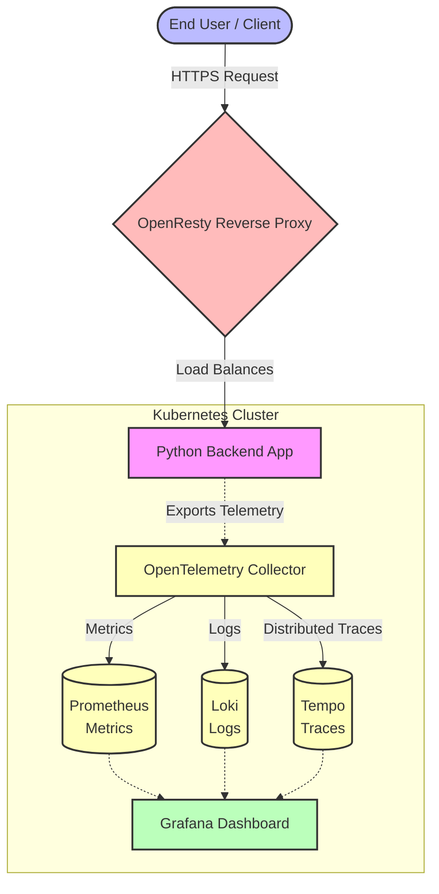
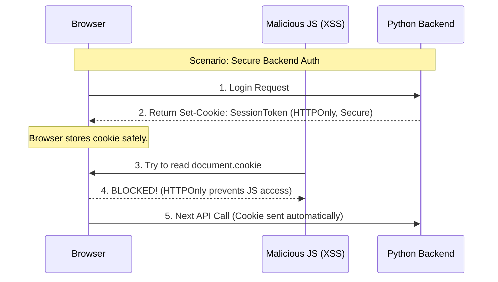

# Chapter 1: Architecture Diagrams

*Use these Mermaid diagrams to visually explain the architecture and observability stack during your video.*

## Diagram 1: The Ultimate Observability Stack

## Diagram 2: Backend Auth vs Frontend Auth

