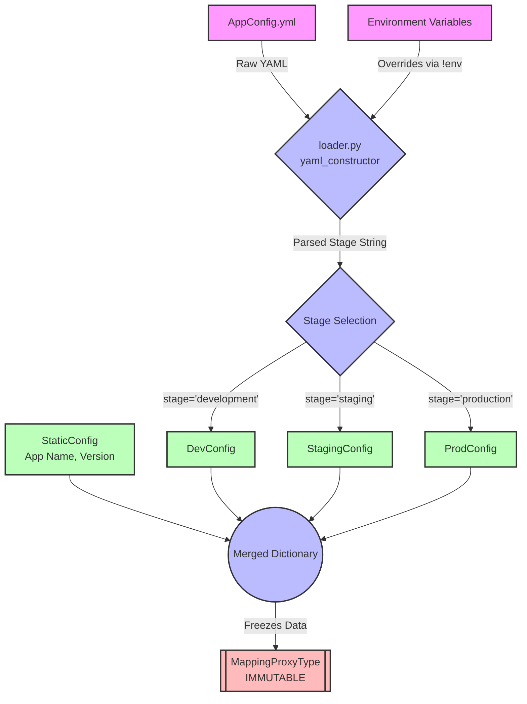

# Chapter 2: Architecture Diagrams

*Use this Mermaid diagram to visually explain the configuration loading flow.*

## Diagram 1: The Configuration Loading Flow

```mermaid
graph TD
    %% Styling
    classDef file fill:#f9f,stroke:#333,stroke-width:2px;
    classDef process fill:#bbf,stroke:#333,stroke-width:2px;
    classDef model fill:#bfb,stroke:#333,stroke-width:2px;
    classDef final fill:#fbb,stroke:#333,stroke-width:2px;

    %% Nodes
    A[AppConfig.yml]:::file
    B[Environment Variables]:::file
    C{loader.py<br/>yaml_constructor}:::process
    
    D[StaticConfig<br/>App Name, Version]:::model
    E{Stage Selection}:::process
    
    F[DevConfig]:::model
    G[StagingConfig]:::model
    H[ProdConfig]:::model
    
    I((Merged Dictionary)):::process
    J[[MappingProxyType<br/>IMMUTABLE]]:::final

    %% Flow
    A -->|Raw YAML| C
    B -->|Overrides via !env| C
    C -->|Parsed Stage String| E
    
    E -- stage='development' --> F
    E -- stage='staging' --> G
    E -- stage='production' --> H
    
    D --> I
    F --> I
    G --> I
    H --> I
    
    I -->|Freezes Data| J
```
